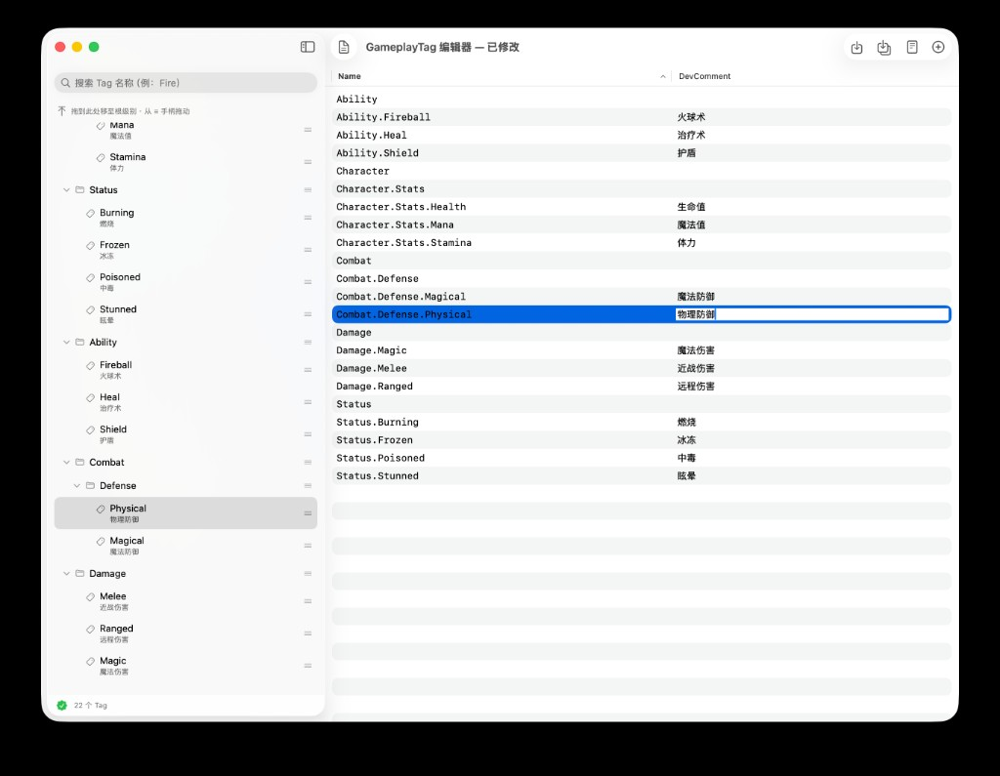
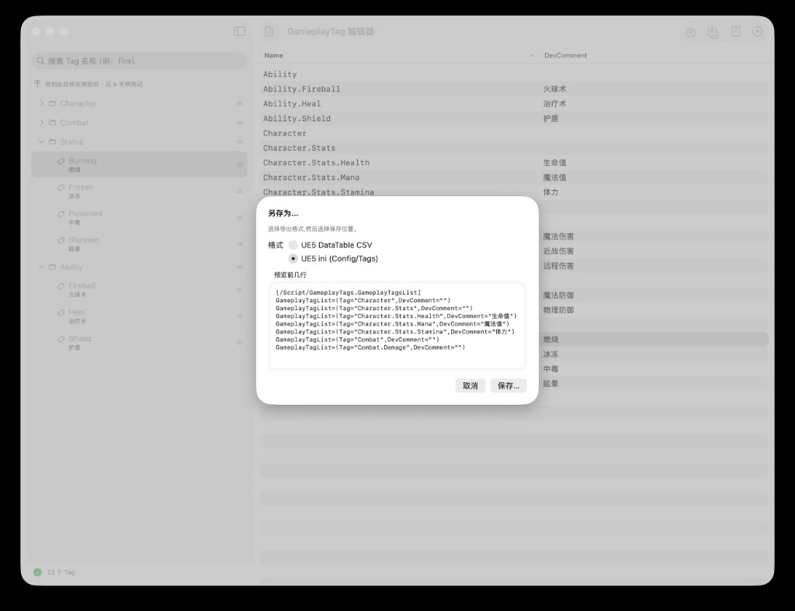

# SwiftGameplayTag

一个用 SwiftUI 实现的、可视化编辑 Unreal Engine 5 `GameplayTag` 的 macOS 工具。

## 截图

左侧树形层级 + 右侧表格内联编辑；树与表格选择同步，支持搜索与拖拽。



另存为时可选择 UE5 DataTable CSV 或 ini，并预览导出内容。



## 功能

- 左侧 **树形面板**：层级展示 Tag，支持新增 / 重命名 / 删除 / 拖拽改父子与同级顺序
- 右侧 **表格**：当前文档内全部 Tag 的 `Name`、`DevComment` 可内联编辑；点击行会同步选中左侧树并展开路径
- **导入 / 导出**（仅两种 UE5 格式）：
  - UE5 DataTable CSV（`Name,Tag,DevComment`）
  - UE5 ini（`Config/Tags/*.ini`，`GameplayTagList=(Tag="...",DevComment="...")`）
- **格式自动识别**：打开 CSV 或 ini 时按内容自动解析；旧版 CSV 若含 `CategoryText` 列会被忽略
- **原始文件预览**：未修改时显示磁盘原文；修改后显示当前格式的导出预览
- **路径校验**：重复路径、非法字符等会在底部状态栏提示
- **撤销 / 重做**：⌘Z / ⇧⌘Z
- **搜索过滤**：侧边栏搜索框过滤 Tag 名称，命中节点及其祖先会自动展开
- **拖拽**（左侧 `≡` 手柄）：
  - 拖到 **folder** 节点 → 成为其子 Tag
  - 拖到 **leaf** 节点 → 成为其同级（排在后面）
  - 按住 **Option** 拖到节点 → 成为其同级（排在前面）
  - 拖到顶部「根级别」区域 → 移到根
- 首次启动加载内置示例 `sample.csv`

## 快捷键

| 操作 | 快捷键 |
|------|--------|
| 打开 CSV / ini | ⌘O |
| 保存（当前格式） | ⌘S |
| 另存为（可选 CSV / ini） | ⇧⌘S |
| 新建根 Tag | ⇧⌘N |
| 撤销 / 重做 | ⌘Z / ⇧⌘Z |
| 删除选中 Tag | Delete |
| 重命名 | 双击树节点，或右键「重命名…」 |
| 添加子 Tag | 右键「添加子 Tag」 |

## 运行

```bash
swift run              # 开发运行
swift test             # 单元测试
swift build -c release # Release 构建
./scripts/make_app.sh  # 打包为 SwiftGameplayTag.app
```

要求 macOS 26+、Swift 6.2+。

## 导入到 UE5

本工具导出两种 UE 可直接使用的格式。在 App 里用 **文件 → 另存为…**（⇧⌘S），或已有文件路径时 **⌘S** 保存当前格式，再按下面方式导入 UE 项目。

### 方式 A：ini 配置（推荐）

1. 另存为时选择 **UE5 ini (Config/Tags)**，默认文件名为 `DefaultGameplayTags.ini`。
2. 将文件放到 UE 项目目录：`<YourProject>/Config/Tags/`（没有 `Tags` 文件夹则新建）。
3. 打开 UE 编辑器 → **Edit → Project Settings → Gameplay Tags**，勾选 **Import Tags From Config**（默认通常已开启）。
4. 重启编辑器；若编辑器已在运行，可将 **Import Tags From Config** 取消勾选再重新勾选，以重新加载 ini。
5. 新 Tag 会出现在 Gameplay Tag 选择器与 **Manage Gameplay Tags** 窗口中。

ini 文件格式示例：

```ini
[/Script/GameplayTags.GameplayTagsList]
GameplayTagList=(Tag="Character.Stats.Health",DevComment="生命值")
GameplayTagList=(Tag="Combat.Damage.Melee",DevComment="近战伤害")
```

### 方式 B：DataTable CSV

1. 另存为时选择 **UE5 DataTable CSV**，默认文件名为 `GameplayTagTable.csv`。
2. 在 UE **Content Browser** 中右键 → **Import**，选择该 CSV。
3. 导入对话框中，资产类型选 **DataTable**，行结构（Row Type）选 **GameplayTagTableRow**。
4. 打开 **Edit → Project Settings → Gameplay Tags**，在 **Gameplay Tag Table List** 中点击 **+**，添加刚导入的 DataTable。
5. 之后若在本工具中修改了 CSV，在 Content Browser 中右键该 DataTable → **Reimport**（或 **Reimport with New File**）即可更新 Tag。

CSV 表头须为 `Name,Tag,DevComment`，示例：

```csv
Name,Tag,DevComment
0,Character.Stats.Health,生命值
1,Combat.Damage.Melee,近战伤害
```

## 目录结构

```
Sources/SwiftGameplayTag/
├── SwiftGameplayTagApp.swift   # App 入口、菜单快捷键
├── SampleCSV.swift             # 内置示例加载
├── Models/
│   ├── GameplayTag.swift       # 标签数据模型（name + devComment）
│   └── GameplayTagNode.swift   # 树节点
├── Parsing/
│   ├── CSVParser.swift         # RFC4180 CSV 解析
│   ├── CSVBridge.swift         # CSV / ini 互转与格式检测
│   └── TagTreeBuilder.swift    # 扁平 name → 树
├── State/
│   ├── TagStore.swift          # 树 CRUD、撤销/重做、选择、文件状态
│   └── FileCommands.swift      # 打开/保存触发器
├── Views/
│   ├── ContentView.swift       # NavigationSplitView 双栏
│   ├── TagTreeSidebar.swift    # 左侧树 + 搜索 + 拖拽
│   ├── CSVPane.swift           # 右侧表格
│   ├── RawCSVWindow.swift      # 原始文件 / 导出预览
│   ├── SaveAsSheet.swift       # 另存为格式选择
│   ├── AddRootSheet.swift      # 新建根 Tag
│   ├── AddChildSheet.swift     # 添加子 Tag
│   ├── TagDragSupport.swift    # 拖拽载荷与放置规则
│   └── ToolbarItems.swift
└── Resources/
    └── sample.csv              # 内置示例
```

## 数据模型

`GameplayTag` 仅包含 `name`（完整点分路径，如 `Combat.Damage.Melee`）与 `devComment`（编辑器 tooltip）。详见 `Sources/SwiftGameplayTag/Models/GameplayTag.swift`。
